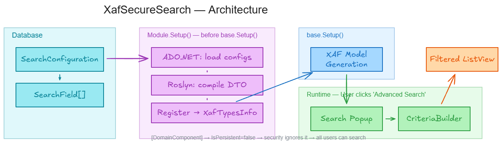

# XafSecureSearch



**Database-driven, runtime-compiled advanced search panels for DevExpress XAF Blazor Server applications.**

XafSecureSearch lets administrators define search panel configurations through the XAF UI — selecting which entity to search, which properties to expose, and how each property should be filtered. At application startup, the system compiles these configurations into .NET types using Roslyn, registers them as XAF `[DomainComponent]` non-persistent objects, and presents them as popup search forms on the corresponding ListViews. Users fill in the search criteria and click OK; the system builds a `CriteriaOperator` from the filled properties and applies it to the ListView's collection source.

No code generation files to maintain. No rebuild required after changing search panel configurations (just an app restart). Fully compatible with XAF integrated security — including non-admin users with restricted roles.

## What It Does

1. **Configuration UI** — Administrators create `SearchConfiguration` records, pick a target entity type, and click "Populate Properties" to auto-discover all eligible properties. They mark which fields to include in the search panel using the `IsIncluded` checkbox.

2. **Runtime Roslyn Compilation** — On app startup, the system reads active configurations from the database via ADO.NET (before EF Core is initialized), generates C# source for a `[DomainComponent]` DTO class, and compiles it in-memory using Roslyn. The compiled type is registered with `XafTypesInfo` and added to `AdditionalExportedTypes` so XAF creates proper model nodes and DetailViews.

3. **Search Panel Popup** — When a user navigates to a ListView that has a registered search configuration, an "Advanced Search" toolbar button appears. Clicking it opens a popup DetailView with the compiled DTO. The user fills in values — strings support wildcards (`*` and `?`), numeric/date fields support range filtering (From/To), reference properties show lookup editors.

4. **Criteria Application** — On popup close, `CriteriaBuilder` reflects over the DTO, reads non-null property values, and constructs a `CriteriaOperator` tree. This gets applied to the ListView's `CollectionSource.Criteria`, filtering the data. String fields use `LIKE` with wildcard translation by default, or exact match if configured. Range fields produce `>=` / `<=` pairs.

## Architecture

```
SearchConfiguration (DB)
    │
    ├── SearchField[] (DB, IsIncluded flag)
    │
    ▼
Module.Setup() ──► SearchDtoRegistry.CompileFromDatabase()
    │                   │
    │                   ├── ADO.NET: load configs + fields
    │                   ├── SearchDtoCompiler.GenerateSource() → C# string
    │                   ├── Roslyn CSharpCompilation → in-memory assembly
    │                   ├── XafTypesInfo.RegisterEntity(dtoType)
    │                   └── module.AdditionalExportedTypes.Add(dtoType)
    │
    ▼
base.Setup(application)  ──► XAF model generation picks up DTO types
    │
    ▼
SearchPanelController (ViewController<ListView>)
    │
    ├── OnActivated: check if entity has a registered DTO → show/hide button
    ├── CustomizePopupWindowParams: create NonPersistentObjectSpace + DetailView
    └── Execute: CriteriaBuilder.BuildCriteria() → apply to ListView
```

### Key Components

| Component | Purpose |
|-----------|---------|
| `SearchConfiguration` | Entity storing the search panel definition (target type, active flag) |
| `SearchField` | Entity storing individual field config (property name, type, display name, IsIncluded, exact match, range filter) |
| `SearchDtoCompiler` | Generates C# source and compiles it via Roslyn into an in-memory assembly |
| `SearchDtoRegistry` | Singleton managing compilation lifecycle, type registration, and lookup |
| `SearchPanelController` | `ViewController<ListView>` that shows the "Advanced Search" popup |
| `CriteriaBuilder` | Reflects over a filled DTO and builds `CriteriaOperator` expressions |
| `SearchConfigurationController` | UI actions: Populate Properties, Compile & Activate, Export Source |
| `PropertyEligibility` | Determines which entity properties are eligible for search fields |

### Security Compatibility

XAF integrated security works seamlessly because `[DomainComponent]` types are **non-persistent** — `SecurityStrategy.IsSecuredType()` returns `false` for them. This means:

- No permission configuration needed for search DTO types
- `HasRightsToModifyMemberController` automatically allows editing
- Works for all users including restricted (non-admin) roles
- No `AnonymousAllowedTypes` registration required

### Critical Implementation Details

- **Compile before `base.Setup()`** — DTO types must be registered with `XafTypesInfo` and `AdditionalExportedTypes` before XAF builds its model. Otherwise, the model won't have proper `IModelClass` nodes and property editors won't bind values.

- **Compile only once** — In Blazor Server, `Module.Setup(XafApplication)` is called per user session. The `SearchDtoRegistry` guards against re-compilation to prevent type mismatches between the model (built from the first compilation) and the registry.

- **CompositeObjectSpace** — When creating the popup's `NonPersistentObjectSpace`, an additional persistent `ObjectSpace` is added for reference property lookups.

## Tech Stack

- .NET 8
- DevExpress XAF v25.2 (Blazor Server)
- EF Core with SQL Server
- Microsoft.CodeAnalysis.CSharp (Roslyn) for runtime compilation
- Serilog for diagnostics

## Quick Start

```bash
# Build
dotnet build XafSecureSearch/XafSecureSearch.Blazor.Server/XafSecureSearch.Blazor.Server.csproj

# Run (requires SQL Server LocalDB)
dotnet run --project XafSecureSearch/XafSecureSearch.Blazor.Server/XafSecureSearch.Blazor.Server.csproj
```

Default accounts (Debug builds only):
- **Admin** / empty password — full access
- **User** / empty password — restricted Default role

## License

This project is provided as-is for educational and reference purposes.
